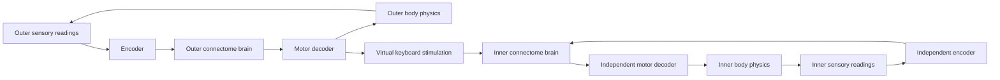

# Virtual Fly Lab

**A connectome-driven fly. A physics world. A second fly with a brain of its own.**

Move an odor source. Stimulate sensory neurons. Watch measured neural activity
become movement. Virtual Fly Lab connects a whole-brain Drosophila spiking model
to a NeuroMechFly body and puts the experiment in your browser.

Then it goes one level deeper: the outer fly's output can stimulate a second fly,
running in an independent physics world with its own full connectome brain.
**Two bodies. Two neural states. One interactive lab.**

**138,639 neurons per brain · 15,091,983 weighted connection rows per brain ·
Native Windows · Local browser interface**

[Quick start](#quick-start) · [Inside the lab](#inside-the-lab) ·
[Architecture](#architecture) · [Results](#results-and-current-limits) ·
[Technical guide](docs/TECHNICAL_GUIDE.md)

> Research prototype: the single-brain reference loop took about 92 wall-clock
> seconds per simulated second. Sensory and motor mappings are engineered;
> this is not validated fly behavior or learned computer use.

## Inside the lab

| Experience | What you control or observe |
| --- | --- |
| **Interactive physics** | Watch the walking body, orbit the camera, and reposition the odor source. |
| **Measured activity in 3D** | Explore up to 6,000 sampled neurons and 10,000 connections; inspect root IDs and spike counts. |
| **Direct stimulation** | Change left/right sensory inputs and compare descending activity with motor output. |
| **An independent inner brain** | Give the second fly its own stimulation, odor input, pause state, and neural activity view. |
| **Continuous sessions** | Run until you stop, pause, or advance a single 10 ms interval. |
| **Inspectable experiments** | Retain configurations, stimulation, activity, motor commands, trajectories and control events. |

Brain positions are **schematic, not anatomical reconstructions**. Brightness
reflects measured spike counts. A bright connection marks a spiking source;
it does not measure signal propagation.

## Quick start

Developed on native Windows 11 with Python 3.12.12, 24 GB RAM and an RTX 3050 A
Laptop GPU with 4 GB VRAM. Windows 10 has not been separately verified. Neural
simulation and physics use the CPU; rendering uses OpenGL/WebGL. CUDA is not
required. Two brains need more memory and computation; minimum RAM has not been
benchmarked.

Install [Git](https://git-scm.com/downloads) and [uv](https://docs.astral.sh/uv/),
then run in PowerShell:

```powershell
git clone https://github.com/Logesh-vr/fuitfly2.git
cd fuitfly2
.\scripts\setup.ps1
.\.venv\Scripts\python.exe scripts\download_data.py
.\.venv\Scripts\python.exe -m virtual_fly live
```

Open **[127.0.0.1:8765](http://127.0.0.1:8765/)**, wait for the models to load,
then press **Run simulation**. For subsequent launches, double-click
**Start Interactive Fly.cmd**.

If PowerShell blocks the setup script, use a process-local policy override:
`powershell -NoProfile -ExecutionPolicy Bypass -File .\scripts\setup.ps1`.

Setup creates `.venv` and installs Python into `.python`. Downloads require
internet and are verified against recorded SHA-256 hashes. The installed lab
serves browser assets locally and binds to loopback. Environments, datasets,
downloaded upstream source, and generated outputs are excluded from Git.

**Start with one brain:** set `enabled: false` in `configs/nested.yaml` before
launching. Restore `true` and restart to enable the inner world.

## Your first experiment

1. Run the simulation and move the outer odor source on the arena map.
2. Adjust left/right sensory stimulation; compare firing rates and walking drives.
3. In **Fly's computer**, change the inner fly's odor and direct stimulation.
4. Disconnect the keyboard bridge: the inner fly keeps its own sensory loop.
   Pause the inner fly to freeze its brain and body together.
5. Use **End session** to stop and preserve the logs. Closing the tab alone
   does not stop the simulation.

Controls apply at completed simulation boundaries. Outer **Manual walking**
freezes only the outer brain; the inner brain continues unless paused. A pacing
cap slows execution and cannot accelerate the solver.

## Architecture



Each brain uses the published Shiu/FlyWire model through Brian2. Each body uses
FlyGym on MuJoCo with its hybrid walking controller. Every 10 ms control interval
advances 100 physics steps of 0.1 ms.

The inner brain runs in a separate process with its own clock, random seed,
neural state and decoder. Its own descending-neuron activity drives its legs.
The outer keyboard adds sensory stimulation; it does not copy outer motor
commands into the inner legs. Both simulations execute on the host PC.

The 3D workstation is currently decorative, with a separate live screen panel.
Physical typing and inner-screen feedback to the outer brain remain future work.

### Configure the experiment

| File | Purpose |
| --- | --- |
| [neurons.yaml](configs/neurons.yaml) | Select sensory/output populations by annotation or exact root IDs. |
| [closed_loop.yaml](configs/closed_loop.yaml) | Timesteps, odor environment and sensory encoding. |
| [decoder.yaml](configs/decoder.yaml) | Rate smoothing, speed gain and turning gain. |
| [nested.yaml](configs/nested.yaml) | Second world and virtual keyboard sensory stimulation. |

Restart after configuration changes. Default left/right groups contain
1,116 / 1,133 olfactory neurons and 646 / 647 descending neurons.

## Results and current limits

Historical single-seed engineering checks on the development laptop. Times
exclude model construction and final file encoding.

| Experiment | Simulated time | Wall time | Result |
| --- | ---: | ---: | --- |
| Scripted body | 1.00 s | 10.26 s | Walked 13.46 mm |
| Whole brain | 0.30 s | 22.53 s | Stimulation activated descending populations |
| Single-brain closed loop | 1.00 s | 91.83 s | Source distance fell from 16.24 to 6.68 mm |
| No-stimulation control | 1.00 s | 83.76 s | Zero motor commands; about 0.11 mm distance reduction |
| Scripted baseline | 1.00 s | 9.23 s | Finished 4.42 mm from source |

The neural trial did **not** reach the 2 mm arrival radius. The scripted baseline
finished closer. These checks demonstrate coupling, not chemotaxis.
Both full connectomes have loaded together; a synthetic-model backend test
verifies independent clocks, activity and process cleanup. Nested full-scale
behavior and the browser interface await manual validation. The table does not
benchmark two-brain performance.

## Run the modules independently

```powershell
.\.venv\Scripts\python.exe -m virtual_fly body
.\.venv\Scripts\python.exe -m virtual_fly brain
.\.venv\Scripts\python.exe -m virtual_fly closed_loop
.\.venv\Scripts\python.exe -m pytest -q
```

Batch runs support `--duration`, `--output` and `--realtime`. Choose a new output
directory to preserve previous runs. Batch mode saves plots and videos; live mode
streams logs to timestamped `outputs/live/` directories.

```text
virtual_fly/
  brain.py, body.py, interface.py  Neural model, physics, translation
  loop.py, timing.py             Fixed-step coupling and pacing
  live.py, live_worker.py        Local server and simulation worker
  nested.py, inner_brain.py      Inner world and isolated brain process
  brain_view.py, static/         Activity geometry and browser renderer
configs/                        Experiment settings
scripts/                        Setup, verified downloads, comparisons
tests/                          Backend unit and regression tests
docs/TECHNICAL_GUIDE.md          Model details, interfaces, assumptions
```

## Scientific scope and credits

Sensory encoding and motor decoding are design choices, not learned from the
connectome. The brain model omits the full ventral nerve cord; the walking
controller supplies that control layer. The odor field is analytic. Flight,
grooming and learned computer operation are not implemented. The
[technical guide](docs/TECHNICAL_GUIDE.md) documents model adaptations and limits.

Built on [Shiu's brain model](https://github.com/philshiu/Drosophila_brain_model),
[FlyGym / NeuroMechFly](https://github.com/NeLy-EPFL/flygym), Brian2, MuJoCo,
FlyWire/Codex annotations and Three.js. Download provenance and hashes are in
[data_manifest.json](data_manifest.json); exact dependencies are in
[requirements.txt](requirements.txt).

[Implementation roadmap](IMPLEMENTATION_PLAN.md) ·
[Third-party notices](THIRD_PARTY_NOTICES.md)

Original project code currently has no project-wide license. Third-party
components retain their respective licenses.
